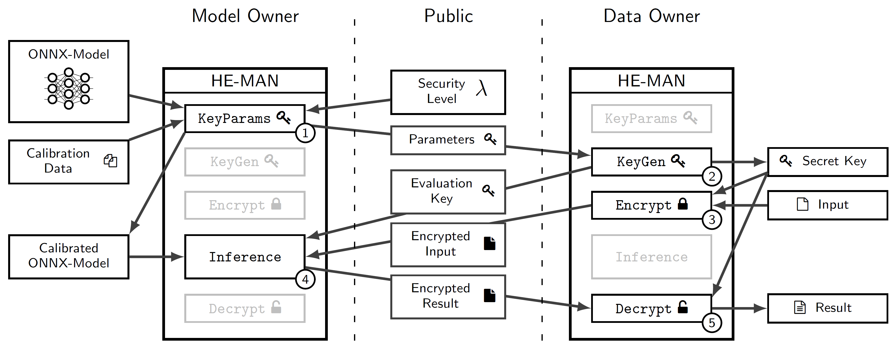

# HE-MAN-Concrete



## Usage
To generate a set of keys into the folder `<SECRET_KEY_PATH>`:
```shell
cargo run -- keygen <SECRET_KEY_PATH>
```
To encrypt the plaintext stored in file `<PLAINTEXT_INPUT_PATH>` using the set of keys stored in folder `<SECRET_KEY_PATH>` and write the resulting ciphertext into the file `<CIPHERTEXT_OUTPUT_PATH>` (*not implemented*):
```shell
cargo run -- encrypt <SECRET_KEY_PATH> <PLAINTEXT_INPUT_PATH> <CIPHERTEXT_OUTPUT_PATH>
```
To evaluate the model stored in file `<MODEL_PATH>` for the ciphertext input stored in file `<CIPHERTEXT_INPUT_PATH>` using the evaluation key stored in folder `<EVALUATION_KEY_PATH>` and write the encrypted model output into the file `<CIPHERTEXT_OUTPUT_PATH>` (*not implemented*):
```shell
cargo run -- inference <EVALUATION_KEY_PATH> <MODEL_PATH> <CIPHERTEXT_INPUT_PATH> <CIPHERTEXT_OUTPUT_PATH>
```
To decrypt the ciphertext stored in file `<CIPHERTEXT_INPUT_PATH>` using the set of keys stored in folder `<SECRET_KEY_PATH>` and write the resulting plaintext into the file `<PLAINTEXT_OUTPUT_PATH>` (*not implemented*):
```shell
cargo run -- decrypt <SECRET_KEY_PATH> <CIPHERTEXT_INPUT_PATH> <PLAINTEXT_OUTPUT_PATH>
```
To show how the program or a specific command is used:
```shell
cargo run -- --help
cargo run -- <COMMAND> --help
```

## Dev setup in VSCode
use this command to clone repo and create a dev container, then use command above to run
```
Remote-Containers: Clone Repository in Container Volume...
```


## Evaluation

### Setup
- Install Rust and Cargo: `curl https://sh.rustup.rs -sSf | sh`
- Install Python (3.9)
- Install Python dependencies: `pip install argparse pathlib numpy tqdm`
- `cd he-man-concrete`
- Build he-man-concrete: `RUSTFLAGS="-C target-cpu=native" cargo build --release`

### Run evaluations
- `cd evaluation`
- Run evaluation: `python benchmark.py -m cryptonets` (Attention: This evaluation may take several minutes to hours!)
- Parameters:
  - -m: model [cryptonets, lenet5 _(default)_, mobilefacenets]
  - -s: start-index of samples, default: 0
  - -n: number of samples, default: 10


## License
This software uses several dependencies that have different licenses. It is the responsibility of the user of this software to ensure they have the proper rights to the underlying dependencies.
